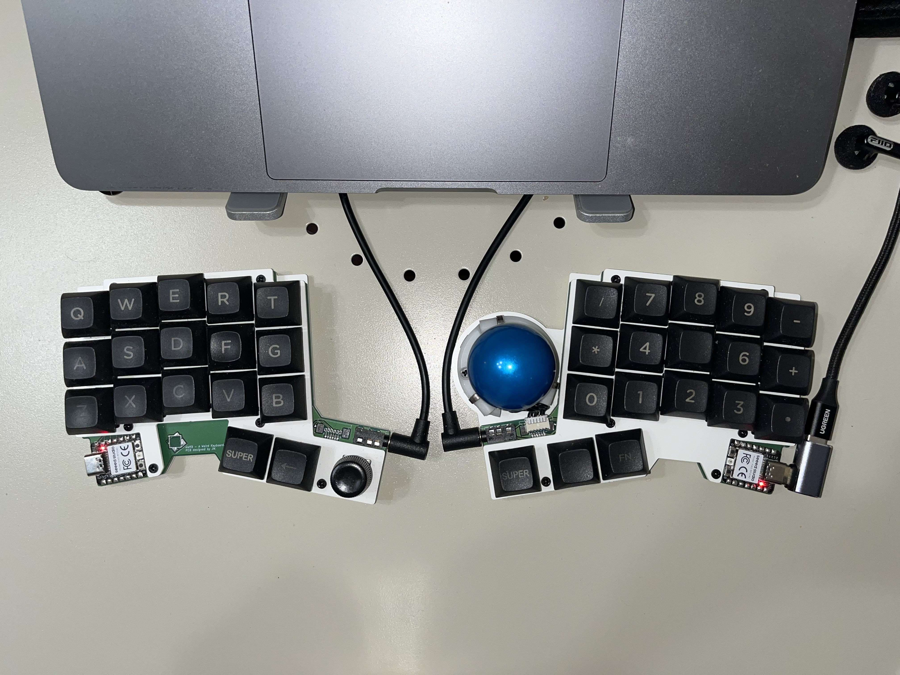
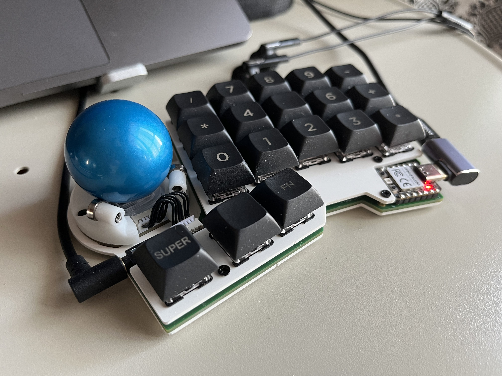
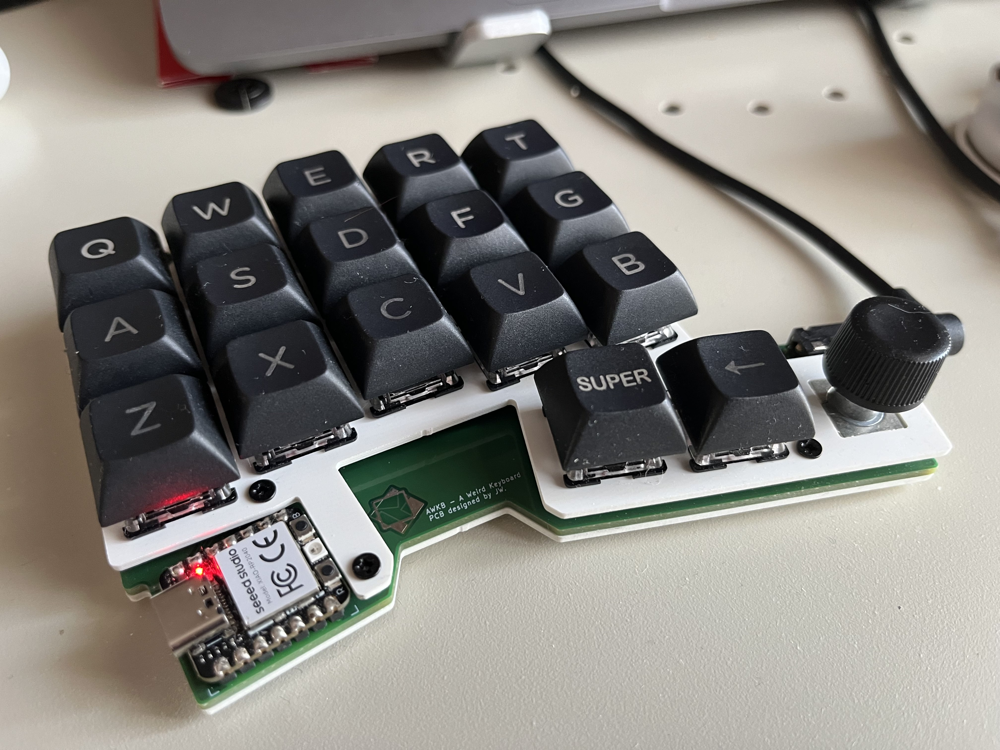

# AWKB - A Weird Keyboard

Nothing fancy, just another Seeed Studio Xiao RP2040 based 36key split keyboard with features like
Japanese Matrix, trackball (pmw3360 based sensor), rotary encoder, and etc.

hardware: https://github.com/wj-zhe/awkb/tree/main/hardware/rev2  
firmware: https://github.com/wj-zhe/awkb/tree/main/firmware/rev2

optical sensor: https://github.com/wj-zhe/optical-sensor

